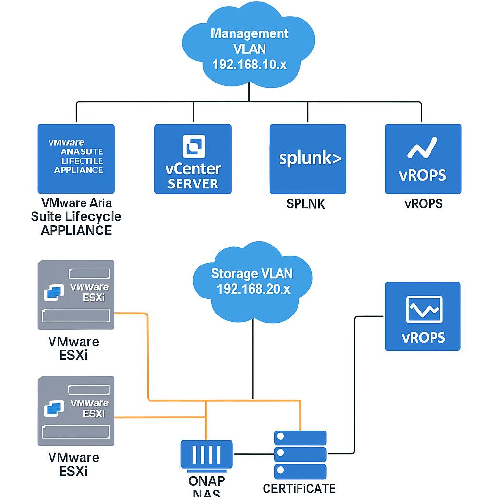

# 🏡 Homelab: Enterprise Virtualization & Monitoring Stack

This repository documents and automates a full-featured homelab designed for enterprise-grade virtualization, identity management, and observability.

## 🔧 Components
- **2x VMware ESXi Hosts** – Core hypervisors
- **vCenter Server** – Centralized VM orchestration
- **QNAP NAS (iSCSI)** – Shared storage
- **Active Directory & DNS** – Identity and name resolution
- **Splunk** – Log aggregation and dashboards - Need to rebuild, currently down
- **Certificate Server** – Internal PKI
- **VMware Aria Suite Lifecycle Appliance** – Automation and lifecycle management - Need to rebuild, currently down
- **vROPs** – Performance and capacity analytics - Need to rebuild, currently down

## 📐 Architecture

## 📦 Terraform Modules - Will be learning soon
- [`terraform/esxi/`](Terraform/esxi/main.tf) – ESXi host provisioning
- [`terraform/ad/`](Terraform/AD/main.tf) – AD domain setup
- [`terraform/networking/`](Terraform/Networking/main.tf) – VLAN segmentation

## 📊 Monitoring & Traffic Flow
- Splunk dashboards for:
  - VM resource usage
  - AD login events
  - iSCSI throughput
- vROPs for:
  - Capacity planning
  - Performance alerts
  - Health scores

## 🚀 Goals
- Practice enterprise-grade infrastructure design
- Automate deployments with Terraform - Will be learning soon
- Monitor and secure services with Splunk and PKI - Need to rebuild Splunk, currently down
- Showcase hybrid cloud readiness and scalability

## 🤝 Contributions
Open to collaboration on automation, monitoring, and extending this lab to hybrid cloud platforms.
